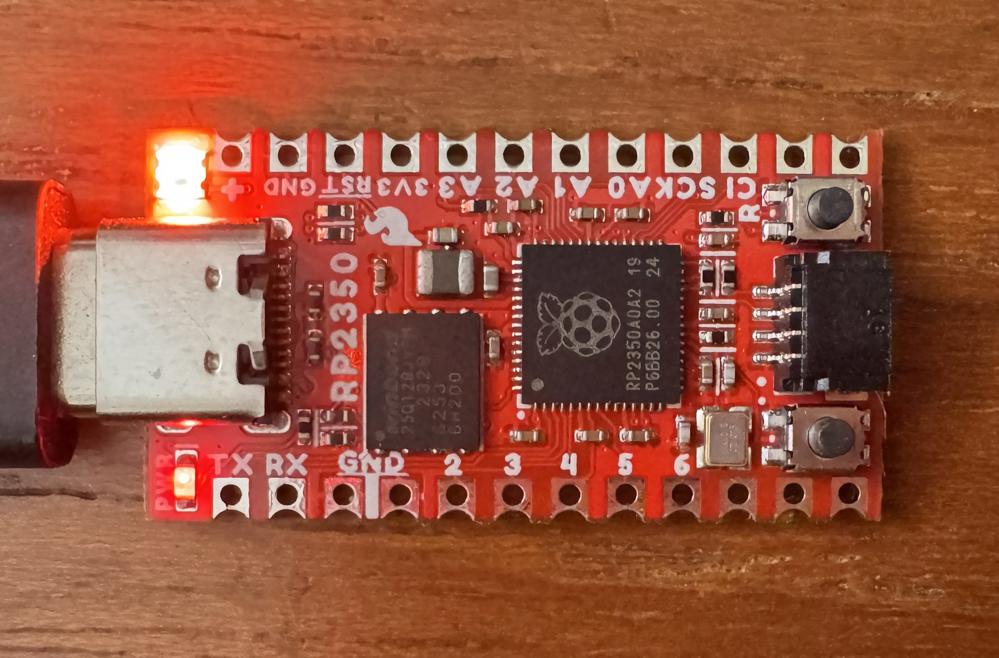

# pico2-neopixel

An example project demonstrating how to drive a Neopixel RGB LED from an RP2350.




❗️ This example was originally designed to build into a Mach-O binary on macOS.  
❗️ As a result, it does not currently build properly inside an Ubuntu container.  
❗️ To support Linux, it needs to be built as an ELF file instead.  
🙏 The Swift Stream community welcomes your help in making this example work on Linux.  
🎯 Specifically, the `Makefile` should be updated to produce an ELF binary.

## Requirements

An RP2350 board, such as the "SparkFun Pro Micro - RP2350".

Everything you need to build the firmware is already pre-installed in this container including `pico-sdk`.

## Configuring

This example uses the hard coded constant `LED_PIN` in `Application.swift` to select the GPIO pin used to drive the attached Neopixel RGB LED. If you are using the "SparkFun Pro Micro - RP2350" no configuration is necessary, if you are using a different board you will need to adjust this constant to the pin used to drive your LED.

Example diff:

```diff
diff --git a/pico2-neopixel/Sources/Application/Application.swift b/pico2-neopixel/Sources/Application/Application.swift
index f6867b5..a2291db 100644
--- a/pico2-neopixel/Sources/Application/Application.swift
+++ b/pico2-neopixel/Sources/Application/Application.swift
@@ -11,7 +11,7 @@
 
 import RP2350
 
-let LED_PIN: UInt32 = 25
+let LED_PIN: UInt32 = 18
 
 /// Configures GPIO pin as a front-end to PIO0.
 func configure_output_pin() {
```

## Building the firmware

**Build it simply via `Build` button.**

Otherwise manually:
```console
make
```

> This will currently fail because the `Makefile` is still targeting Mach-O.

## Running on Real Hardware

### Step 1: Connect Your Board

Connect the **Pico2** board to your host machine using a USB cable.

Make sure it's in the USB Mass Storage firmware upload mode (either hold the BOOTSEL button while plugging the board, or make sure your Flash memory doesn't contain any valid firmware).

### Step 2: Copy the Firmware

Copy the `.build/release/Application.uf2` file to the root of the `RP2350` Mass Storage device to trigger flashing the program into memory (after which the device will reboot and run the firmware).

The RGB LED should be animating through the color wheel.
