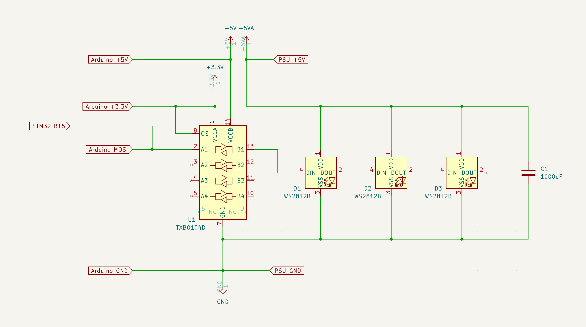

# stm32-neopixel


This demo is designed to run on an STM32 microcontroller and some additional hardware, detailed below:

1. An [STM32F746G Discovery kit](https://www.st.com/en/evaluation-tools/32f746gdiscovery.html)
2. A 3.3V to 5V level shifter such as [Texas Instrument's TXB0104](https://www.ti.com/lit/ds/symlink/txb0104.pdf) which can be found on a breakout board for easier use, such as: [SparkFun Voltage-Level Translator Breakout](https://www.sparkfun.com/products/11771)
3. A NeoPixel WS2812 or compatible LED Strip; such as: [SparkFun LED RGB Strip](https://www.sparkfun.com/products/15205)
4. A breadboard, such as: [SparkFun Translucent Breadboard](https://www.sparkfun.com/products/9567)
5. A 5V power supply

Connect the components as shown in the schematic below:



We recommend including a capacitor across the LED strip power supply.

❗️ This example was originally designed to build into a Mach-O binary on macOS.  
❗️ As a result, it does not currently build properly inside an Ubuntu container.  
❗️ To support Linux, it needs to be built as an ELF file instead.  
🙏 The Swift Stream community welcomes your help in making this example work on Linux.  
🎯 Specifically, the `Makefile` should be updated to produce an ELF binary.

## Requirements

Everything you need to build the firmware is already pre-installed in this container.

> 💡 **Note:** Flashing the board via `stlink` is **not supported in the container**.

## Building the firmware

**Build it simply via `Build` button.**

Otherwise manually:
```console
make
```

> This will currently fail because the Makefile is still targeting Mach-O.

## Running on Real Hardware

To run the firmware on STM32 board, you will need to install `stlink` on your **host machine** (outside the container).

> Container also includes `stlink` but there is no easy way to bridge usb devices into container yet.

### Step 1: Connect Your Board

Connect the **STM32F746G-DISCO** board to your host machine using a USB cable.

### Step 2: Install `stlink`

#### Debian/Ubuntu

```
sudo apt update
sudo apt install -y stlink-tools
```

#### macOS

```
brew install stlink
```

#### Windows

Open PowerShell

> Press Win + X, then choose Windows PowerShell (Admin)

1. Install Chocolatey (if not already installed)

```
Set-ExecutionPolicy Bypass -Scope Process -Force; `
[System.Net.ServicePointManager]::SecurityProtocol = [System.Net.ServicePointManager]::SecurityProtocol -bor 3072; `
iex ((New-Object System.Net.WebClient).DownloadString('https://community.chocolatey.org/install.ps1'))
```

2. Install ST-Link tools using Chocolatey

Once Chocolatey is installed, just run:
```
choco install stlink -y
```

### Step 3: Flash the Firmware

Once installed, use the following commands from your host terminal to flash the firmware:

```
st-flash --reset write .build/release/Application.bin 0x08000000
```

The LED strip should light up and slowly animate a color gradient.
